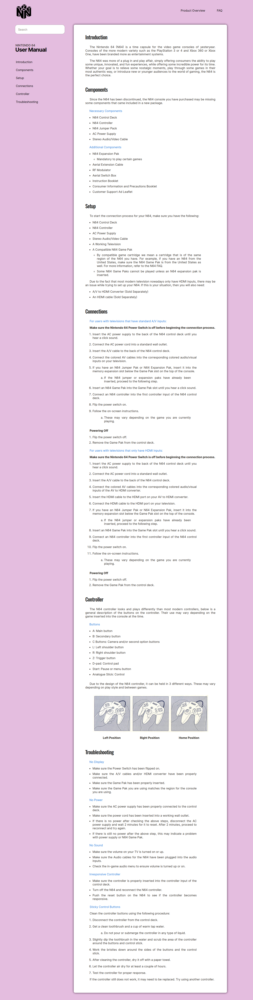

# Nintendo 64 User Manual

 
 

**Certification Project**

Project for _freeCodeCamp_ **Responsive Web Design** course

A technical documentation page of the nintendo 64 user manual using HTML and CSS.

## Project Overview

The objective of this project was to make an app similar to "https://technical-documentation-page.freecodecamp.rocks/" for a subject of my choosing and passing the test's requirements, practicing what was learned on the third module of the course, like **Pseudo Selectors** and **Media Queries** for **Responsive Design**.

 

_
Project's screenshot
_

 

### **Acknowledgments**

For this project i tried to reproduce some elements from the design of Vercel's documentation page on my interface, that you can find here: https://vercel.com/docs

### **Troubleshooting and considerations**

- I had a lot of trouble making a media query for the mobile version from the default 1080p desktop version, the whole interface broke and it was kinda hard to bring it to an acceptable state.

  - **Solution:** Commented the entire CSS code and began the media query code from scratch, activating the default CSS afterwards and fixing some minor issues that remained.
  - **Reminder for the next project:** Try out the mobile-first approach.

- I wanted to put a search icon on the search bar, but couldn't figure out how to put it on the placeholder of the search input.
  - **Solution:** I could've put both the search bar and the icon inside a div with the same background color of the input
    so it would look the way i wanted, but it wouldn't function the way i wanted.
  - **Reminder for the next project:** I don't know, maybe this can be solved later with javascript or some other tool.

 

_obs.: There's a hidden code element on the html, because freeCodeCamp had it required on the project's user stories, but i didn't wanted a random piece of code lost in the middle of my project so i display:hidden it_

 
