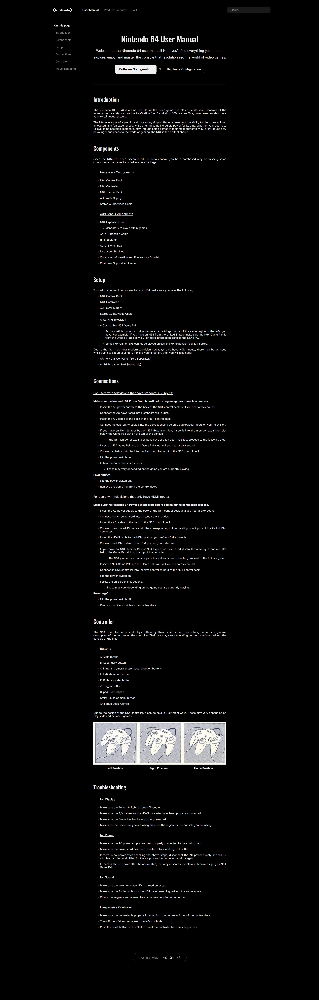

# Nintendo 64 User Manual
 

 
 

**Certification Project**  

Project for *freeCodeCamp* **Responsive Web Design** course  

A technical documentation page of the nintendo 64 user manual using HTML and CSS.

## Objective
The objective of this project was to make an app similar to "https://technical-documentation-page.freecodecamp.rocks/" for a subject of my choosing and passing the test's requirements, practicing what was learned on the third module of the course, like **Pseudo Selectors** and **Media Queries** for **Responsive Design**.

 

*
Project's brief screenshot
* 

 
For a screenshot of the full page click below:

 

Full page screenshot

 

  

 
 
For a screenshot of the mobile's page version click below:

 

Mobile screenshot

 

  

 
 
 
 
 
 
    
Project heavily inspired by Whereby articles page which you can access here: https://whereby.helpscoutdocs.com/article/452-getting-started
